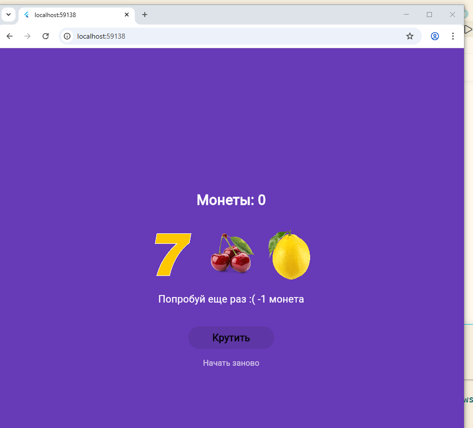

# Лабораторная работа №6 - Flutter: StatefulWidget и управление состоянием

## Информация об авторе
- **Фамилия, имя:** Ткаченко Виктория
- **Группа:** ИСП-231
- **Дата сдачи:** 2026

## Что изучили в ходе работы
- Создание StatefulWidget для управления изменяемым состоянием приложения
- Работу с генерацией случайных чисел через dart:math
- Добавление и регистрацию изображений в assets через pubspec.yaml
- Логику игрового автомата: проверку выигрышных комбинаций, подсчёт монет
- Блокировку кнопок при определённых условиях (недостаточно монет)
- Анимацию вращения барабанов с разными фазами скорости
- Вынос повторяющихся виджетов в отдельные классы для переиспользования

## Скриншот финального приложения


---

##  Инструкция по запуску

1. **Клонировать репозиторий:**
   ```bash
   git clone https://github.com/vikatkacenko35_marker/Flutter_Lab5.git
   cd Flutter_Lab3
   ```
Установить зависимости:

```bash
flutter pub get
```
Запустить в Chrome:

```bash
flutter run -d chrome
```
